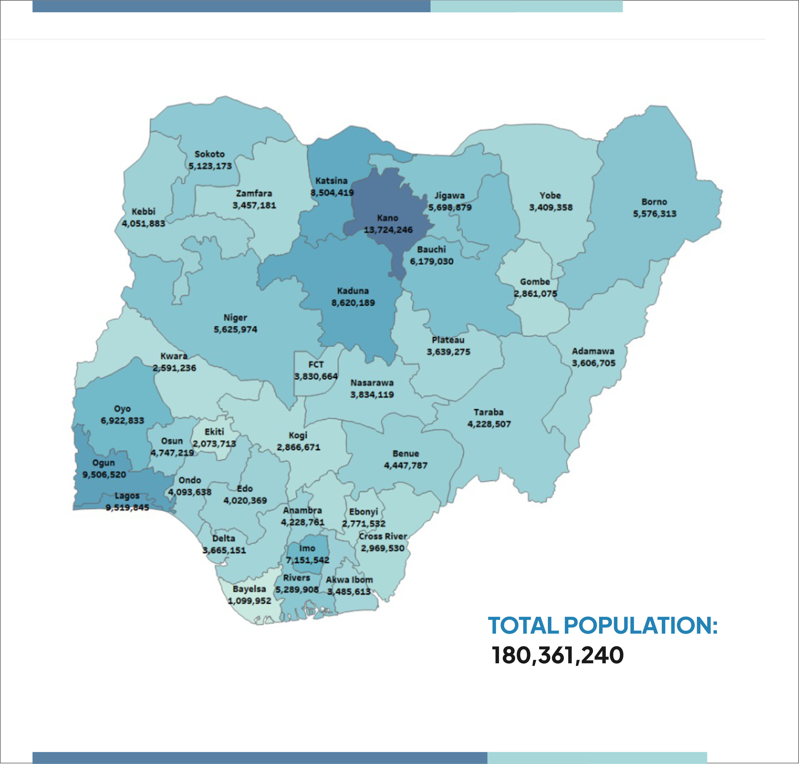
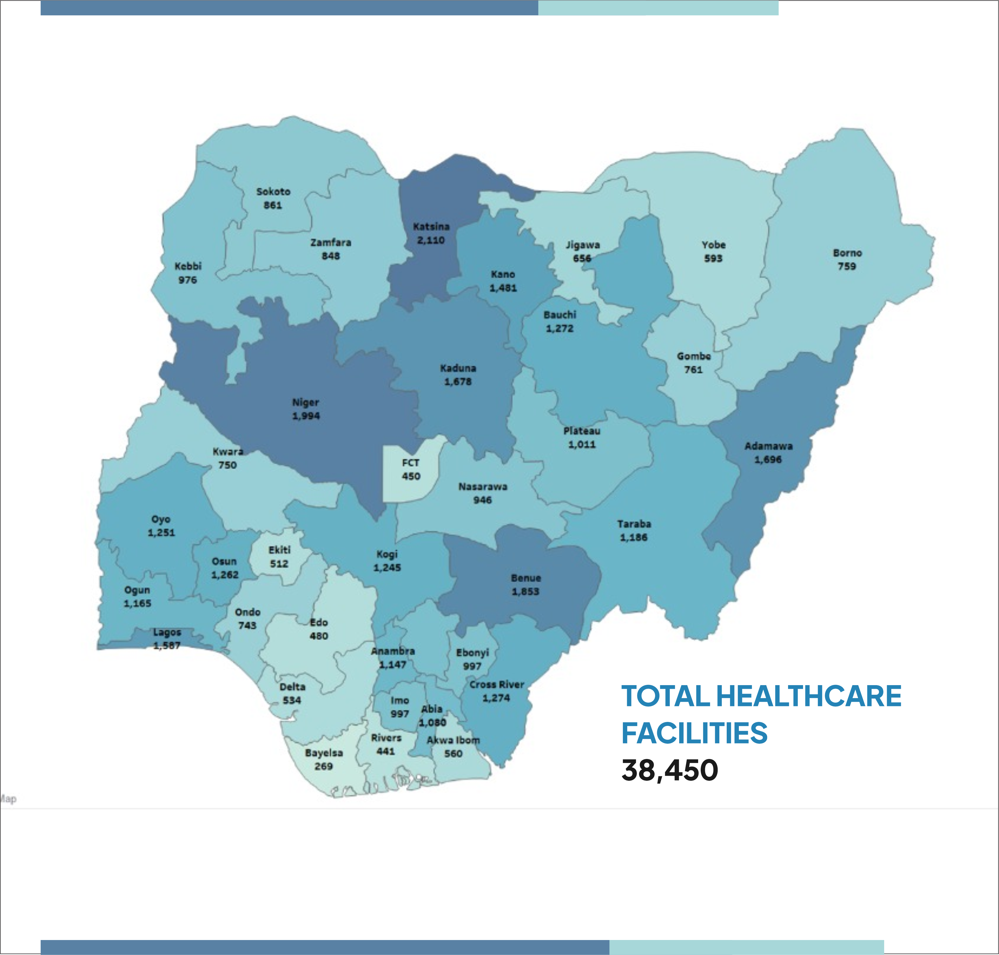
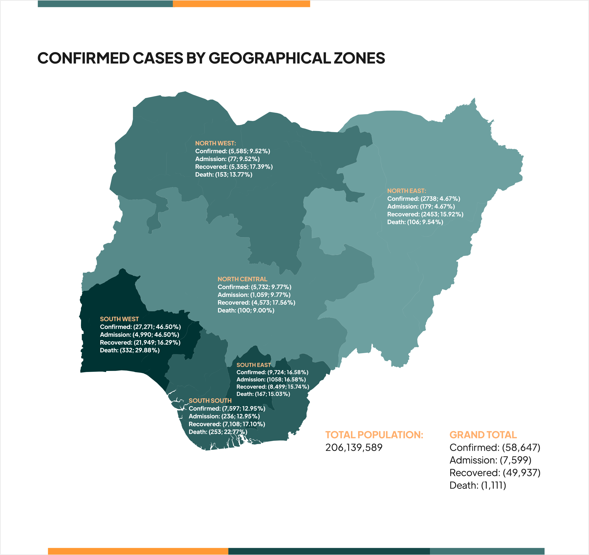
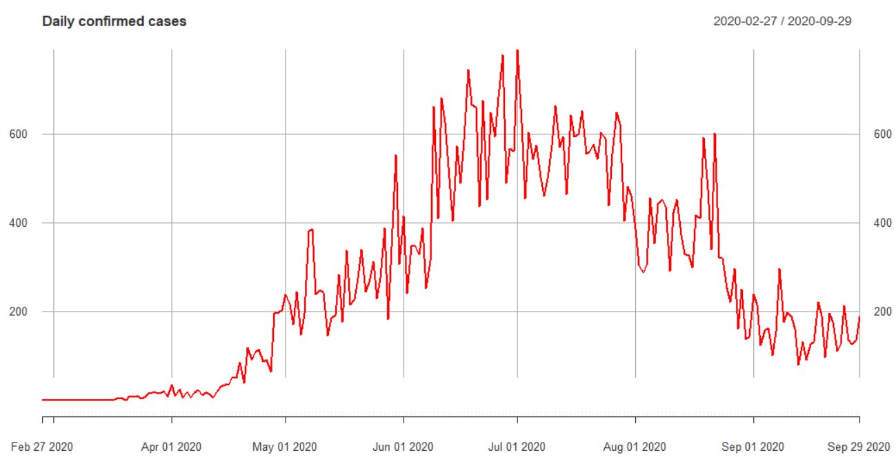
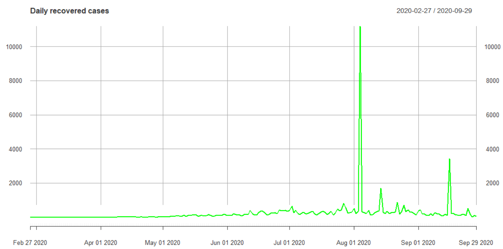
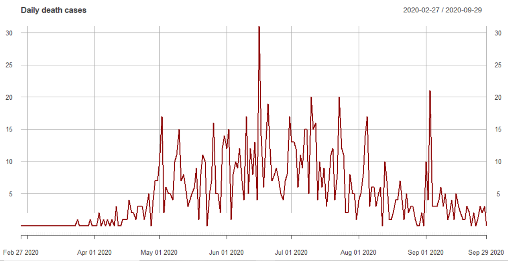
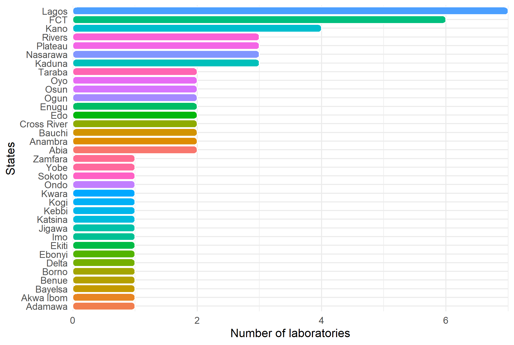
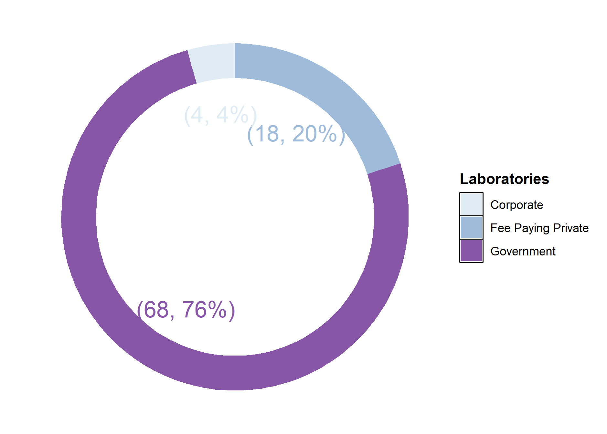
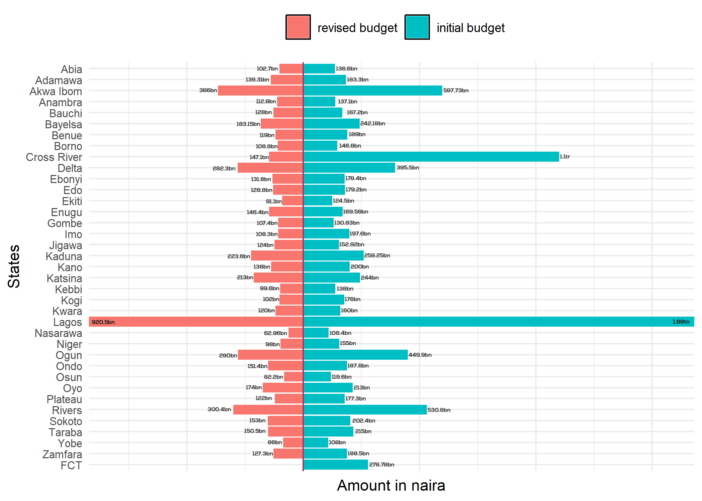
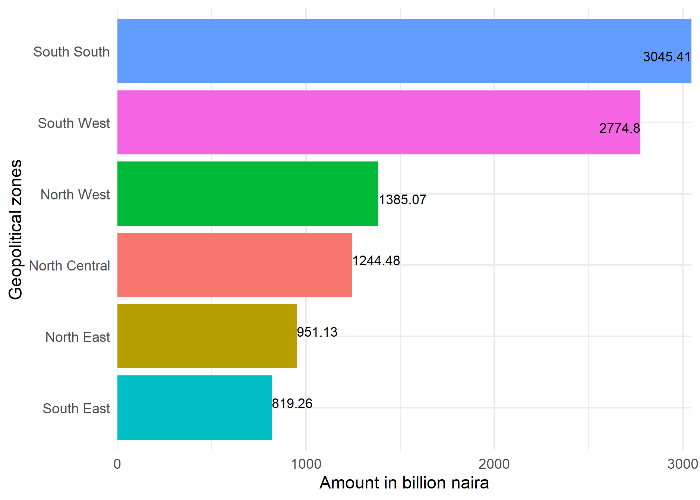

# An-Exploratory-Assessment-of-a-Multidimensional-Healthcare-and-Economic-Data-on-COVID-19-in-Nigeria

This repo is for the data in brief data article that describes the healthcare facilities, state budget, and laboratories in Nigeria in response to the COVID-19 pandemic and the economic situation of the entire population of the country amidst the pandemic.

## Highlight

- Nigeria population estimate and healthcare facilities

- COVID-19 data analytics

- COVID-19 testing laboratories

- Budget analysis in 2020

- NCDC Twitter timelines

## Nigeria population estimate and healthcare facilities

 

 

## COVID-19 data analytics

 

 

 

 

## COVID-19 testing laboratories

 

 

## Budget analysis in 2020

 

 

## NCDC Twitter timelines

 

 

